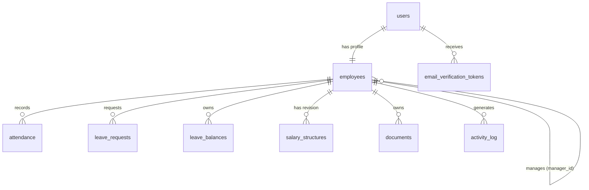

# Dayflow HRMS — Database Schema & Data Model Reference

This document provides a comprehensive reference for the database schema, table structures, column definitions, relations, enums, and seeding mechanics in **Dayflow HRMS**.

---

## 1. Schema Architecture Overview

Dayflow uses **PostgreSQL 15** queried via **Drizzle ORM** (`src/db/schema.ts`).

### 1.1 Entity Relationship Diagram (ERD)

---

## 2. Table Definitions & Column Specifications

---

### 2.1 `users`
Auth identity table storing login credentials and system roles.

| Column | Type | Constraints | Description |
|---|---|---|---|
| `id` | `uuid` | Primary Key, Default: `gen_random_uuid()` | Unique user identifier |
| `employee_code` | `varchar(32)` | Unique, Not Null | Employee code / login ID (e.g. `EMP101`) |
| `email` | `varchar(255)` | Unique, Not Null | Work email address |
| `password_hash` | `text` | Not Null | Bcrypt hashed password (cost factor 12) |
| `role` | `enum` | Not Null, Default: `'employee'` | Access level: `'employee'` or `'admin'` |
| `is_active` | `boolean` | Not Null, Default: `true` | Active status (false disables login) |
| `email_verified_at` | `timestamp` | Nullable | Email activation timestamp |
| `created_at` | `timestamp` | Not Null, Default: `now()` | Record creation timestamp |
| `updated_at` | `timestamp` | Not Null, Default: `now()` | Last record update timestamp |

---

### 2.2 `employees`
Personal profile and HR details.

| Column | Type | Constraints | Description |
|---|---|---|---|
| `id` | `uuid` | Primary Key, Default: `gen_random_uuid()` | Unique employee profile ID |
| `user_id` | `uuid` | Foreign Key (`users.id`), Unique, On Delete Cascade | Linked authentication user record |
| `first_name` | `varchar(100)` | Not Null | First name |
| `last_name` | `varchar(100)` | Nullable | Last name |
| `phone` | `varchar(32)` | Nullable | Contact phone number |
| `address` | `text` | Nullable | Residential address |
| `photo_url` | `text` | Nullable | Avatar image URL |
| `job_title` | `varchar(100)` | Nullable | Job designation (e.g. `Backend Engineer`) |
| `department` | `varchar(100)` | Nullable | Department name (e.g. `Engineering`) |
| `employment_type` | `varchar(32)` | Not Null, Default: `'full_time'` | `'full_time'`, `'part_time'`, `'contract'`, `'intern'` |
| `date_of_joining` | `date` | Nullable | Date joined (`YYYY-MM-DD`) |
| `date_of_birth` | `date` | Nullable | Date of birth (`YYYY-MM-DD`) |
| `manager_id` | `uuid` | Foreign Key (`employees.id`), Nullable | Direct manager profile ID |
| `created_at` | `timestamp` | Not Null, Default: `now()` | Record creation timestamp |
| `updated_at` | `timestamp` | Not Null, Default: `now()` | Last record update timestamp |

---

### 2.3 `attendance`
Daily check-in / check-out records.

| Column | Type | Constraints | Description |
|---|---|---|---|
| `id` | `uuid` | Primary Key, Default: `gen_random_uuid()` | Attendance entry ID |
| `employee_id` | `uuid` | Foreign Key (`employees.id`), On Delete Cascade | Employee reference |
| `work_date` | `date` | Not Null | Work date (`YYYY-MM-DD`) |
| `check_in_at` | `timestamp` | Nullable | Check-in timestamp |
| `check_out_at` | `timestamp` | Nullable | Check-out timestamp |
| `status` | `enum` | Not Null, Default: `'present'` | `'present'`, `'absent'`, `'half_day'`, `'leave'` |
| `is_manual` | `boolean` | Not Null, Default: `false` | Marks HR manual override |
| `note` | `text` | Nullable | HR override note or explanation |
| `created_at` | `timestamp` | Not Null, Default: `now()` | Creation timestamp |
| `updated_at` | `timestamp` | Not Null, Default: `now()` | Update timestamp |

*Index*: Unique constraint on `(employee_id, work_date)`.

---

### 2.4 `leave_requests`
Employee time-off applications and approval tracking.

| Column | Type | Constraints | Description |
|---|---|---|---|
| `id` | `uuid` | Primary Key, Default: `gen_random_uuid()` | Request ID |
| `employee_id` | `uuid` | Foreign Key (`employees.id`), On Delete Cascade | Applicant reference |
| `leave_type` | `enum` | Not Null | `'paid'`, `'sick'`, `'unpaid'` |
| `start_date` | `date` | Not Null | Leave start date |
| `end_date` | `date` | Not Null | Leave end date |
| `days` | `integer` | Not Null | Computed business days (weekdays only) |
| `remarks` | `text` | Nullable | Applicant comments |
| `status` | `enum` | Not Null, Default: `'pending'` | `'pending'`, `'approved'`, `'rejected'` |
| `decided_by` | `uuid` | Foreign Key (`employees.id`), Nullable | Approving/rejecting admin ID |
| `decision_comment` | `text` | Nullable | HR approval/rejection reason |
| `decided_at` | `timestamp` | Nullable | Decision timestamp |
| `created_at` | `timestamp` | Not Null, Default: `now()` | Application timestamp |

---

### 2.5 `leave_balances`
Annual leave entitlements and usage tracking.

| Column | Type | Constraints | Description |
|---|---|---|---|
| `id` | `uuid` | Primary Key, Default: `gen_random_uuid()` | Balance record ID |
| `employee_id` | `uuid` | Foreign Key (`employees.id`), On Delete Cascade | Employee reference |
| `year` | `integer` | Not Null | Calendar year (e.g. `2026`) |
| `leave_type` | `enum` | Not Null | `'paid'`, `'sick'`, `'unpaid'` |
| `entitled_days` | `integer` | Not Null | Total annual allowance (e.g. 18 Paid, 12 Sick) |
| `used_days` | `integer` | Not Null, Default: `0` | Total approved used days |

*Index*: Unique constraint on `(employee_id, year, leave_type)`.

---

### 2.6 `salary_structures`
Effective-dated versioned salary structures.

| Column | Type | Constraints | Description |
|---|---|---|---|
| `id` | `uuid` | Primary Key, Default: `gen_random_uuid()` | Salary revision ID |
| `employee_id` | `uuid` | Foreign Key (`employees.id`), On Delete Cascade | Employee reference |
| `effective_from` | `date` | Not Null | Revision start date |
| `basic` | `numeric(12,2)` | Not Null, Default: `0.00` | Basic salary component |
| `hra` | `numeric(12,2)` | Not Null, Default: `0.00` | House Rent Allowance |
| `allowances` | `numeric(12,2)` | Not Null, Default: `0.00` | Other allowances |
| `deductions` | `numeric(12,2)` | Not Null, Default: `0.00` | Tax / PF deductions |
| `currency` | `varchar(3)` | Not Null, Default: `'INR'` | ISO Currency code |

*Index*: Unique constraint on `(employee_id, effective_from)`.

---

### 2.7 `documents`
Employee document metadata records.

| Column | Type | Constraints | Description |
|---|---|---|---|
| `id` | `uuid` | Primary Key, Default: `gen_random_uuid()` | Document ID |
| `employee_id` | `uuid` | Foreign Key (`employees.id`), On Delete Cascade | Owner reference |
| `name` | `varchar(255)` | Not Null | Document title (e.g. `Offer Letter.pdf`) |
| `category` | `varchar(64)` | Not Null | Category (`id_proof`, `contract`, `tax`) |
| `url` | `text` | Not Null | Document storage URL |
| `created_at` | `timestamp` | Not Null, Default: `now()` | Upload timestamp |

---

### 2.8 `activity_log`
Audit feed rendered on the dashboard.

| Column | Type | Constraints | Description |
|---|---|---|---|
| `id` | `uuid` | Primary Key, Default: `gen_random_uuid()` | Log entry ID |
| `employee_id` | `uuid` | Foreign Key (`employees.id`), On Delete Cascade | Actor reference |
| `message` | `text` | Not Null | Human-readable log string |
| `created_at` | `timestamp` | Not Null, Default: `now()` | Event timestamp |

---

## 3. Database Seed Mechanics (`src/db/seed.ts`)

Dayflow includes a seed script that populates realistic demo data:

- **Demo Accounts** (Password: `Dayflow#2026`):
  - `asha@dayflow.test` (HR Manager, Admin)
  - `rohan@dayflow.test` (Backend Engineer, Employee)
  - 4 additional employees across Product, QA, Sales, Support.
- **Attendance Records**: 30 consecutive business days of historical check-ins and status calculations.
- **Leave Records**: Pre-populated leave requests including pending, approved, and rejected statuses.
