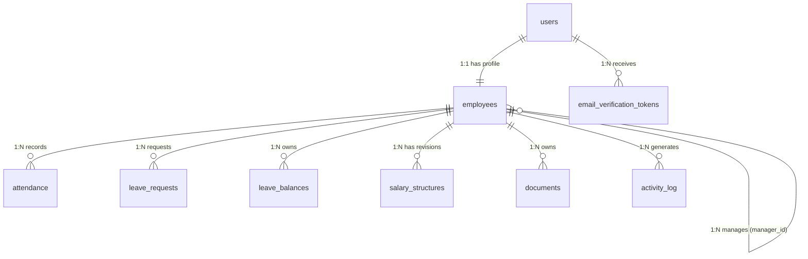

# Dayflow HRMS — Database Schema & ERD Reference

This document provides a comprehensive developer reference for the **PostgreSQL 15** database schema, Entity Relationship Diagram (ERD), table specifications, column constraints, unique indexes, custom enums, Drizzle ORM configuration, and database seeding mechanics in **Dayflow HRMS**.

---

## 1. Schema Architecture Overview

Dayflow utilizes **PostgreSQL 15** managed through **Drizzle ORM** (`src/db/schema.ts`). All tables use PostgreSQL UUID primary keys generated natively via `gen_random_uuid()`. Cascading deletes (`onDelete: "cascade"`) are enforced across all employee-child entity tables to ensure relational integrity.

### 1.1 Entity Relationship Diagram (ERD)



---

## 2. PostgreSQL Custom Enum Definitions

Defined in `src/db/schema.ts`:

```typescript
export const roleEnum = pgEnum("role", ["admin", "employee"]);
export const attendanceStatusEnum = pgEnum("attendance_status", ["present", "absent", "half_day", "leave"]);
export const leaveTypeEnum = pgEnum("leave_type", ["paid", "sick", "unpaid"]);
export const leaveStatusEnum = pgEnum("leave_status", ["pending", "approved", "rejected"]);
```

---

## 3. Exhaustive Table Specifications

---

### 3.1 `users` Table
Stores primary authentication identities, login credentials, system roles, and account state.

| Column | Data Type | Nullable | Constraints & Defaults | Description |
|---|---|---|---|---|
| `id` | `uuid` | No | Primary Key, `default(gen_random_uuid())` | Unique system user ID |
| `employee_code` | `varchar(32)` | No | Unique constraint | Unique login code (e.g., `EMP101`, `HR001`) |
| `email` | `varchar(255)` | No | Unique constraint | Official corporate email address |
| `password_hash` | `text` | No | None | Bcrypt hashed password (cost factor 12) |
| `role` | `roleEnum` | No | `default("employee")` | System privilege level (`admin` \| `employee`) |
| `is_active` | `boolean` | No | `default(true)` | Active status flag (false disables login) |
| `email_verified_at` | `timestamp` | Yes | `default(null)` | Activation timestamp upon email verification |
| `created_at` | `timestamp` | No | `defaultNow()` | Record creation timestamp |
| `updated_at` | `timestamp` | No | `defaultNow()` | Record last modification timestamp |

---

### 3.2 `employees` Table
Stores detailed personal profile information, employment details, and job position assignments. Linked 1:1 with `users`.

| Column | Data Type | Nullable | Constraints & Defaults | Description |
|---|---|---|---|---|
| `id` | `uuid` | No | Primary Key, `default(gen_random_uuid())` | Unique employee profile ID |
| `user_id` | `uuid` | No | Foreign Key (`users.id`), Unique, `onDelete("cascade")` | Reference to parent user account |
| `first_name` | `varchar(100)` | No | None | Employee first name |
| `last_name` | `varchar(100)` | Yes | None | Employee last name |
| `phone` | `varchar(32)` | Yes | None | Contact telephone number |
| `address` | `text` | Yes | None | Residential street address |
| `photo_url` | `text` | Yes | None | Profile avatar image URL |
| `job_title` | `varchar(100)` | Yes | None | Job designation (e.g. `Backend Engineer`) |
| `department` | `varchar(100)` | Yes | None | Department assignment (e.g. `Engineering`) |
| `employment_type` | `varchar(32)` | No | `default("full_time")` | `full_time`, `part_time`, `contract`, `intern` |
| `date_of_joining` | `date` | Yes | None | Date of joining company (`YYYY-MM-DD`) |
| `date_of_birth` | `date` | Yes | None | Employee date of birth (`YYYY-MM-DD`) |
| `manager_id` | `uuid` | Yes | Foreign Key (`employees.id`) | Direct reporting manager ID |
| `created_at` | `timestamp` | No | `defaultNow()` | Profile creation timestamp |
| `updated_at` | `timestamp` | No | `defaultNow()` | Profile last update timestamp |

---

### 3.3 `attendance` Table
Tracks daily check-in timestamps, check-out timestamps, derived work statuses, and HR manual override notes.

| Column | Data Type | Nullable | Constraints & Defaults | Description |
|---|---|---|---|---|
| `id` | `uuid` | No | Primary Key, `default(gen_random_uuid())` | Unique attendance record ID |
| `employee_id` | `uuid` | No | Foreign Key (`employees.id`), `onDelete("cascade")` | Reference to employee profile |
| `work_date` | `date` | No | None | Calendar work date (`YYYY-MM-DD`) |
| `check_in_at` | `timestamp` | Yes | None | Check-in timestamp |
| `check_out_at` | `timestamp` | Yes | None | Check-out timestamp |
| `status` | `attendanceStatusEnum` | No | `default("present")` | `present`, `absent`, `half_day`, `leave` |
| `is_manual` | `boolean` | No | `default(false)` | Flag indicating HR manual override |
| `note` | `text` | Yes | None | HR override note or explanation |
| `created_at` | `timestamp` | No | `defaultNow()` | Entry creation timestamp |
| `updated_at` | `timestamp` | No | `defaultNow()` | Entry last update timestamp |

* **Indexes & Constraints**:
  * `unique("attendance_employee_date_unique")` on `(employee_id, work_date)`

---

### 3.4 `leave_requests` Table
Manages employee time-off applications, computed business days, applicant comments, and HR approval/rejection decisions.

| Column | Data Type | Nullable | Constraints & Defaults | Description |
|---|---|---|---|---|
| `id` | `uuid` | No | Primary Key, `default(gen_random_uuid())` | Unique leave request ID |
| `employee_id` | `uuid` | No | Foreign Key (`employees.id`), `onDelete("cascade")` | Applicant employee ID |
| `leave_type` | `leaveTypeEnum` | No | None | Category (`paid`, `sick`, `unpaid`) |
| `start_date` | `date` | No | None | Leave start date (`YYYY-MM-DD`) |
| `end_date` | `date` | No | None | Leave end date (`YYYY-MM-DD`) |
| `days` | `integer` | No | None | Computed business days (weekdays only) |
| `remarks` | `text` | Yes | None | Employee reason / remarks |
| `status` | `leaveStatusEnum` | No | `default("pending")` | Decision status (`pending`, `approved`, `rejected`) |
| `decided_by` | `uuid` | Yes | Foreign Key (`employees.id`) | Deciding admin employee ID |
| `decision_comment` | `text` | Yes | None | HR approval/rejection comment |
| `decided_at` | `timestamp` | Yes | None | Decision timestamp |
| `created_at` | `timestamp` | No | `defaultNow()` | Application submission timestamp |

---

### 3.5 `leave_balances` Table
Tracks annual leave allocations, entitled days, and consumed days per employee per calendar year.

| Column | Data Type | Nullable | Constraints & Defaults | Description |
|---|---|---|---|---|
| `id` | `uuid` | No | Primary Key, `default(gen_random_uuid())` | Unique balance record ID |
| `employee_id` | `uuid` | No | Foreign Key (`employees.id`), `onDelete("cascade")` | Reference to employee |
| `year` | `integer` | No | None | Calendar year (e.g. `2026`) |
| `leave_type` | `leaveTypeEnum` | No | None | Category (`paid`, `sick`, `unpaid`) |
| `entitled_days` | `integer` | No | None | Annual granted quota (e.g. 18 Paid, 12 Sick) |
| `used_days` | `integer` | No | `default(0)` | Consumed / approved days count |

* **Indexes & Constraints**:
  * `unique("leave_balances_emp_year_type_unique")` on `(employee_id, year, leave_type)`

---

### 3.6 `salary_structures` Table
Stores effective-dated, versioned salary structures detailing pay components and deductions.

| Column | Data Type | Nullable | Constraints & Defaults | Description |
|---|---|---|---|---|
| `id` | `uuid` | No | Primary Key, `default(gen_random_uuid())` | Unique salary structure revision ID |
| `employee_id` | `uuid` | No | Foreign Key (`employees.id`), `onDelete("cascade")` | Reference to employee |
| `effective_from` | `date` | No | None | Revision start date (`YYYY-MM-DD`) |
| `basic` | `numeric(12,2)` | No | `default("0.00")` | Monthly basic salary component |
| `hra` | `numeric(12,2)` | No | `default("0.00")` | House Rent Allowance (HRA) |
| `allowances` | `numeric(12,2)` | No | `default("0.00")` | Special & flexible allowances |
| `deductions` | `numeric(12,2)` | No | `default("0.00")` | Monthly tax & provident fund deductions |
| `currency` | `varchar(3)` | No | `default("INR")` | ISO currency code (e.g. `INR`, `USD`) |

* **Indexes & Constraints**:
  * `unique("salary_structures_emp_effective_unique")` on `(employee_id, effective_from)`

---

### 3.7 `documents` Table
Stores metadata references for employee onboarding and compliance documents.

| Column | Data Type | Nullable | Constraints & Defaults | Description |
|---|---|---|---|---|
| `id` | `uuid` | No | Primary Key, `default(gen_random_uuid())` | Unique document ID |
| `employee_id` | `uuid` | No | Foreign Key (`employees.id`), `onDelete("cascade")` | Document owner ID |
| `name` | `varchar(255)` | No | None | Display document title |
| `category` | `varchar(64)` | No | None | Category (`id_proof`, `contract`, `tax`) |
| `url` | `text` | No | None | File asset URL |
| `created_at` | `timestamp` | No | `defaultNow()` | Upload timestamp |

---

### 3.8 `activity_log` Table
Append-only activity feed rendered on user dashboards.

| Column | Data Type | Nullable | Constraints & Defaults | Description |
|---|---|---|---|---|
| `id` | `uuid` | No | Primary Key, `default(gen_random_uuid())` | Unique activity entry ID |
| `employee_id` | `uuid` | No | Foreign Key (`employees.id`), `onDelete("cascade")` | Actor employee ID |
| `message` | `text` | No | None | Human-readable log string |
| `created_at` | `timestamp` | No | `defaultNow()` | Event logging timestamp |

---

### 3.9 `email_verification_tokens` Table
Manages single-use, 24-hour email activation tokens generated upon user sign-up.

| Column | Data Type | Nullable | Constraints & Defaults | Description |
|---|---|---|---|---|
| `id` | `uuid` | No | Primary Key, `default(gen_random_uuid())` | Token record ID |
| `user_id` | `uuid` | No | Foreign Key (`users.id`), `onDelete("cascade")` | Target user ID |
| `token` | `varchar(64)` | No | Unique constraint | Cryptographic 32-byte hex token |
| `expires_at` | `timestamp` | No | None | Expiration timestamp (24 hours post-creation) |
| `created_at` | `timestamp` | No | `defaultNow()` | Token generation timestamp |

---

## 4. Drizzle ORM Configuration (`drizzle.config.ts`)

```typescript
import { defineConfig } from "drizzle-kit";

export default defineConfig({
  schema: "./src/db/schema.ts",
  out: "./drizzle",
  dialect: "postgresql",
  dbCredentials: {
    url: process.env.DATABASE_URL!,
  },
});
```

---

## 5. Seed Mechanics & Initial Data Set (`src/db/seed.ts`)

Executing `npx tsx src/db/seed.ts` clears all tables and inserts pre-configured demo datasets:

1. **Default Password**: All seeded accounts use `Dayflow#2026` (hashed with bcrypt cost factor 12).
2. **Seeded User Accounts**:
   * **Asha Verma** (`asha@dayflow.test` / `HR001`): Admin / HR Manager
   * **Rohan Sharma** (`rohan@dayflow.test` / `EMP101`): Backend Engineer
   * **Priya Patel** (`priya@dayflow.test` / `EMP102`): Product Designer
   * **Daniel Kim** (`daniel@dayflow.test` / `EMP103`): QA Analyst
   * **Mei Lin** (`mei@dayflow.test` / `EMP104`): Account Executive
   * **Sam Wilson** (`sam@dayflow.test` / `EMP105`): Support Lead
3. **Seeded Leave Entitlements**: 18 Paid days and 12 Sick days per employee for year `2026`.
4. **Seeded Attendance**: 30 business days of check-in history per user.
5. **Seeded Leave Requests**: Historical pending, approved, and rejected leave requests with stamped attendance days.
